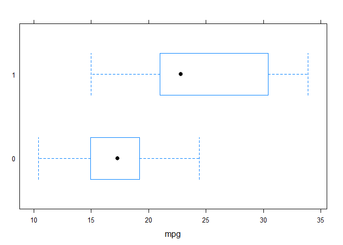
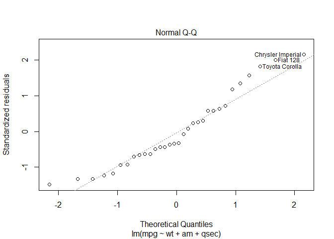
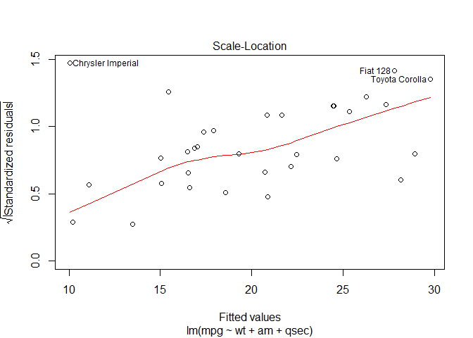
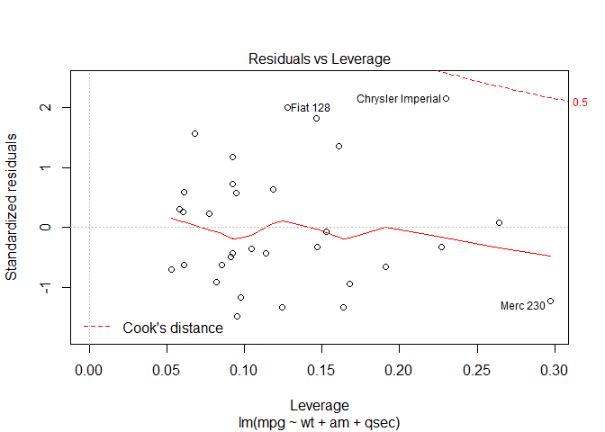
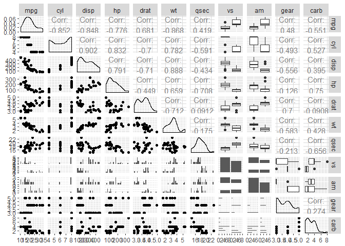

# Executive Summary
This analysis for the Regression Models course attempts to answer whether automatic or manual transmissions improve car mileage (as measured by miles per gallon, or MPG) within a data set from Motor Trend from 1974. A series of models are tested and analyzed to help understand and quantify the effect. It finds that manual transmissions are correlated with improved fuel efficiency within this dataset. It also finds lower weight and higher quarter-second mile time are associated with improved fuel efficiency. 

# Exploring the Data
It appears likely that the type of transmission correlates with a statistically significant difference in fuel efficiency from the Box-Whisker plot below. Controls for additional variables will help confirm the correlation is likely, and may affect the magnitude.

From plotting all pairs of variables (see appendix), it is apparent that displacement, cylinders, horsepower, and weight are are highly correlated among themselves. This creates a multicolinearity issue when adding more than one of these variables, which will be apparent during the variable selection component of this analysis (or otherwise show up in Variance Inflation Factor metrics). Adding more than one of these variables would reduce bias, but increase variance, and could make the model less parsimonious.

# Model Creation and Selection
The results of a simple linear model regressing transmission type on MPG confirms a statistically significant correlation with a p value of 2.85e-04 - well within two standard errors:

term            estimate   std.error   statistic    p.value
------------  ----------  ----------  ----------  ---------
(Intercept)    17.147368    1.124602   15.247492   0.000000
am1             7.244939    1.764422    4.106127   0.000285

Following that, models were generated in a stepwise fashion based on an ANOVA test (not all are shown here). The first model is simply transmission type regressed on fuel effiency, the second adds weight, the third adds quarter-mile, time, and the last (insigificant) model includes all variables.

 res.df        rss   df      sumsq    statistic     p.value
-------  ---------  ---  ---------  -----------  ----------
     30   720.8966   NA         NA           NA          NA
     29   278.3197    1   442.5769   63.0133283   0.0000001
     28   169.2859    1   109.0338   15.5240379   0.0007497
     21   147.4944    7    21.7915    0.4432337   0.8636073

This reveals that weight and quarter-second mile time are also relevant variables. They also lessens the magnitude of the improvement of a manual transmission on fuel efficiency. When regressed alone, a manual transmission was associated with a 7.24 MPG improvement in fuel efficiency. when controlled for other significant variables, this is only a 2.94 MPG improvement - albeit still significant. An additional thousand pounds of weight was associated with a 3.91 MPG decrease, while a one second higher quarter-mile time was associated with a 1.22 MPG increase.

term            estimate   std.error   statistic     p.value
------------  ----------  ----------  ----------  ----------
(Intercept)     9.617781   6.9595930    1.381946   0.1779152
wt             -3.916504   0.7112016   -5.506882   0.0000070
am1             2.935837   1.4109045    2.080819   0.0467155
qsec            1.225886   0.2886696    4.246676   0.0002162

# Model Diagnostics
An analysis of the confidence intervals for each variable indicate a manual transmission almost surely positively correlated with improved mileage, even at the lower bound. Consistent with the p-values, no variable shows a flip in magnitude within the 95% confidence interval.

                    2.5 %      97.5 %
------------  -----------  ----------
(Intercept)    -4.6382995   23.873860
wt             -5.3733342   -2.459673
am1             0.0457303    5.825944
qsec            0.6345732    1.817199

A test of the Variance Inflation Factor (VIF) on the selected multivariate model shows little colinearity (a result of the variable selection process) as indicated by the VIF values, which are all well below typical threshold values of 5 to 10. Furthermore, an analysis of residual plots show little observable pattern, indicating assumptions of residuals being uncorrelated with fitted values are reasonable (see appendix).

# Appendix

## Residual Analysis

## Pairs Plot

